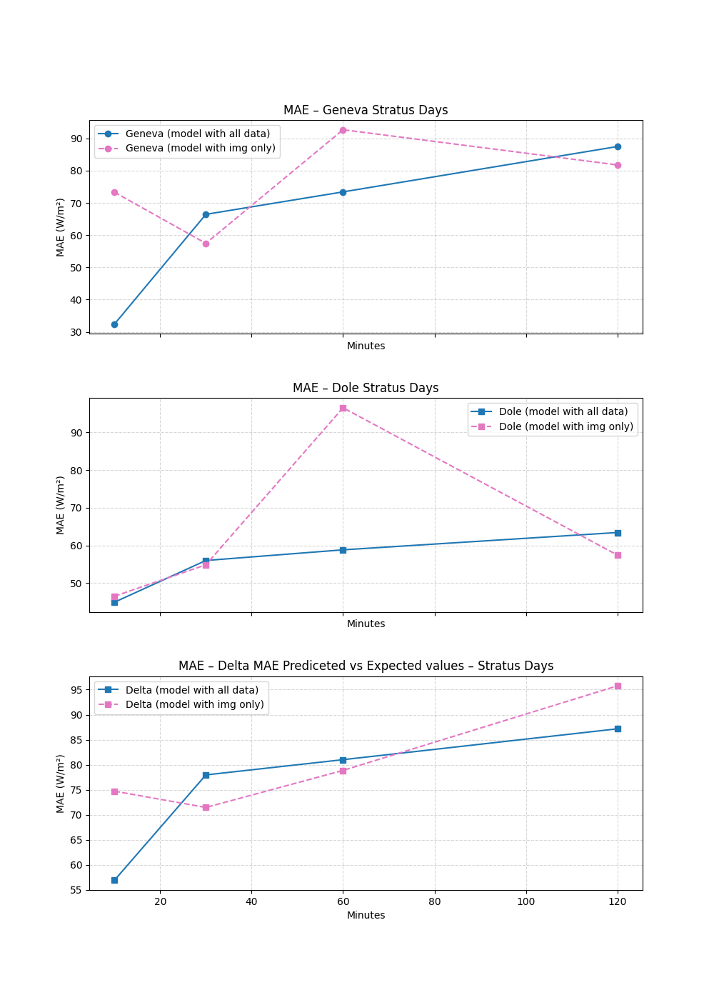
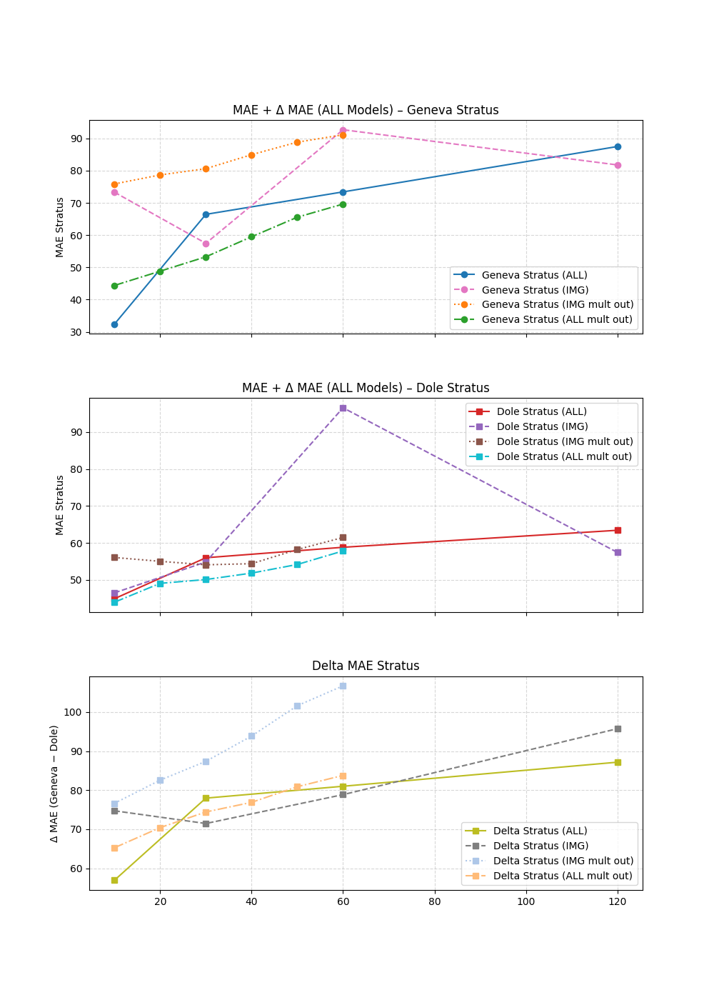

Choix du modèle final 
A partir des résultats de toutes les expériences que j'ai faites, j'ai décidé d'opter comme choix finale du modèle le fait de prendre le rayonnement de Genève et de la Dole comme output pour le train et pour l'affichage des résultats, car sur les images de la Dole on peut voir Genève et non Nyon. J'ai donc décidé d'entraîner mon modèle avec ces données, en prenant tous les mois(hiver automne)et en fixant une période d'une quizeine de jours de stratus pour comparer plus facilement les résultats. Dans les semaines précédentes, j'avais analysé les résultats et constaté que l'ajout ou la suppression de données météorologiques pouvait conduire à des améliorations dans certains cas, mais pas dans d'autres. Il est donc difficile de déterminer si le modèle fonctionne mieux sans ou avec les données météorologiques. C'est pourquoi j'ai décidé d'analyser ces deux cas de manière un peu plus approfondie sur des jours fixes afin de mieux comprendre le comportement de mon modèle.

Nous commençons par une vision globale. 
J'entraîne les deux modèles pour des prédictions à 10 min 30 min 1h et deux heures.
J'ai concentré donc mon analyse sur les jours de stratus vu que c'est la tâche qu'on cherche à resoudre
J'ai donc obtenu les erreurs suivantes.

Les deux premiers graphiques montrent la MAE de DOle et de Genève et le dernier montre la MAE de la différence entre les valeurs attendues et les valeurs prédites.
Comme nous pouvons le constater, nous avons un MAE qui n'augmente pas linéairement et nous n'avons pas un modèle qui soit strictement meilleur que l'autre dans tous les cas. Ce comportement a déjà été observé au cours des dernières semaines. J'ai donc essayé d'analyser plus spécifiquement le comportement des deux modèles.

Si l'on analyse le comportement des deux modèles avec des prédictions à 10 min. Je voulais essayer de tracer un scatter plot pour voir la distribution des delta des valeurs prédites par rapport aux valeurs réelles afin de voir dans quelle mesure elles s'écartent du fit parfait.
Ce qui a améné à avoir les résultats suivants: 

Modèle que avec les images
  
Modèle avec données meteo et images

Comme on peut le voir, la distribution des points est beaucoup plus agrégée dans le modèle avec les données météorologiques. 
Nous pouvons constater que le modèle avec tout a tendance à prédire des valeurs plus élevées que les valeurs réelles, alors que le modèle avec seulement des images a le comportement inverse.
Il serait maintenant intéressant de comprendre ce qui se passe aux dates où nous avons beaucoup de valeurs outiliers et de comparer plus en détail chaque jour.

Pour ce faire, j'utilise des cartes thermiques et je cherche à savoir à quelles heures de la journée et quels jours nous avons des deltas élevés. Une fois ces points isolés, nous pouvons analyser et comparer les courbes entre elles.
<table>
    <tr>
        <td>
            <b>Heatmap modèle avec que les images</b> 
            
        </td>
        <td>
            <b>Heatmap modèle avec img * meteo</b> 
            
        </td>
    </tr>
</table>

Nous constatons qu'il y a beaucoup plus de cas problématiques dans le modèle avec seulement les images. Prenons par exemple le jour 2023-03-02, 2024-10-19, 2024-11-16: 

<table>
    <tr>
        <td>
            <b>Modèle avec seulement les images</b> 
            
        </td>
        <td>
            <b>Modèle avec images + données météo</b> 
            
        </td>
    </tr>
<table>
    <tr>
        <td>
            <b>Modèle avec seulement les images</b> 
            
        </td>
        <td>
            <b>Modèle avec images + données météo</b> 
            
        </td>
    </tr>
</table>
<table>
    <tr>
        <td>
            <b>Modèle avec seulement les images</b> 
            
        </td>
        <td>
            <b>Modèle avec images + données météo</b> 
            
        </td>
    </tr>
</table>

Mais il y a aussi de s jours dans lesquels les deux marchent bien 2024-10-25, 2024-10-30, 2024-11-03:
<table>
    <tr>
        <td>
            <b>Modèle avec seulement les images</b> 
            
        </td>
        <td>
            <b>Modèle avec images + données météo</b> 
            
        </td>
    </tr>
</table>
<table>
    <tr>
        <td>
            <b>Modèle avec seulement les images</b> 
            
        </td>
        <td>
            <b>Modèle avec images + données météo</b> 
            
        </td>
    </tr>
</table>
<table>
    <tr>
        <td>
            <b>Modèle avec seulement les images</b> 
            
        </td>
        <td>
            <b>Modèle avec images + données météo</b> 
            
        </td>
    </tr>
</table>
On constate que dans le modèle où l'on a tout, on a presque toujours un retard de 10 minutes sur les variables prédites, alors que dans celui avec les images, on a beaucoup plus de cas où la disparition du stratus est en retard, mais dans quelques cas il disparaît sans aucun retard. Ainsi, lorsque nous disposons des données météorologiques, le modèle accorde beaucoup plus de confiance aux données météorologiques entrantes, mais lorsque nous n'en disposons pas, nous ne pouvons nous appuyer que sur les images, où parfois ce que nous voyons ne correspond pas aux capteurs. De plus, même si la valeur est en retard de 10 minutes, on peut toujours voir que le starto tend à disparaître plus lentement s'il n'atteint pas un delta entre les deux variations de presque zéro, on peut déjà supposer qu'il est en train de disparaître.

Avant de décider de la version à utiliser, je veux voir si le retard est visible avec des prévisions à une heure.

De toute façon, je regarde la distribution des données

<table>
    <tr>
        <td>
            <b>Modèle avec images + meteo </b> 
            
        </td>
        <td>
            <b>Modèle avec que images</b> 
            
        </td>
    </tr>
</table>

Dans ce cas, la distribution des données est beaucoup plus éparpillée dans les deux cas ; examinons donc les journées plus en détail.

<table>
    <tr>
        <td>
            <b>Heatmap modèle tous les données</b> 
            
        </td>
        <td>
            <b>Heatmap modèle que images</b> 
            
        </td>
    </tr>
</table>
Nous constatons que le modèles avec des images fait mois d'herreur grave on peut donc comparer les curves pour voir les resultats. 

<table>
    <tr>
        <td>
            <b>Modèle avec seulement les images</b> 
            
        </td>
        <td>
            <b>Modèle avec images + données météo</b> 
            
        </td>
    </tr>
<table>
    <tr>
        <td>
            <b>Modèle avec seulement les images</b> 
            
        </td>
        <td>
            <b>Modèle avec images + données météo</b> 
            
        </td>
    </tr>
</table>
<table>
    <tr>
        <td>
            <b>Modèle avec seulement les images</b> 
            
        </td>
        <td>
            <b>Modèle avec images + données météo</b> 
            
        </td>
    </tr>
</table>

<table>
    <tr>
        <td>
            <b>Modèle avec seulement les images</b> 
            
        </td>
        <td>
            <b>Modèle avec images + données météo</b> 
            
        </td>
    </tr>
</table>
<table>
    <tr>
        <td>
            <b>Modèle avec seulement les images</b> 
            
        </td>
        <td>
            <b>Modèle avec images + données météo</b> 
            
        </td>
    </tr>
</table>
<table>
    <tr>
        <td>
            <b>Modèle avec seulement les images</b> 
            
        </td>
        <td>
            <b>Modèle avec images + données météo</b> 
            
        </td>
    </tr>
</table>

Le modèle basé sur l'image seule présente moins de décalage dans l'ensemble et la disparition du stratus se fait progressivement.

Le modèle avec images est donc celui qui permet de s'assurer que l'on a vraiment des prévisions et non des copier-coller, même si dans certains cas on a des valeurs plus élevées en termes d'erreur.

Je voulais aussi faire un test pour savoir si un modèle à sorties multiples pouvait aider à obtenir de meilleurs résultats. J'ai donc essayé un modèle avec et sans images à sorties multiples. Les voici comparés en termes d'erreur

J'ai donc voulu voir comment se comportait un modèle incluant que des images, car il avait obtenu de meilleurs résultats sur les modèles précédents. J'ai donc pris des prédictions de 60 minutes et j'ai cherché à faire une étude comparative avec le modèle à sortie unique.

J'ai examiné la dispersion des données.
<table>
    <tr>
        <td>
            
        </td>
        <td>
            
        </td>
    </tr>
    <tr>
        <td align="center"><b>Modèle à sorties multiples</b></td>
        <td align="center"><b>Modèle à sortie unique</b></td>
    </tr>
</table>

Les deux données étant très dispersées, je consulte les heatmap pour obtenir plus d'informations.

<table>
    <tr>
        <td>
            
        </td>
        <td>
            
        </td>
    </tr>
    <tr>
        <td align="center"><b>Modèle à sorties multiples</b></td>
        <td align="center"><b>Modèle à sortie unique</b></td>
    </tr>
</table>

Quelques example 

Je constate que les erreurs sont nettement plus faibles dans le modèle à sortie unique. Je conserve donc le modèle à sortie unique avec seulement les images.